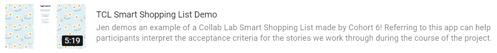
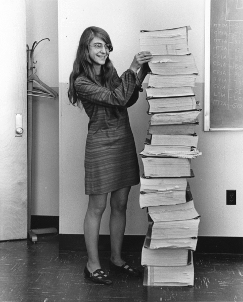

# The Collab Lab Orientación

## ¿Qué es The Collab Lab?

The Collab Lab existe para ayudar a ingenierxs recien empezando sus careras ganar experiencia trabajando colaborativamente con otrxs en un equipo de desarollo de software. Trabajamos remotamente en proyectos reales con otrxs ingenierxs recien empezando sus careras.

La meta del proyecto es trabajar juntxs para crear una lista de mercado “inteligente” que aprende tus habitos al comprar mercado, colocando las cosas que seguramente vas a necesitar pronto al principio de tu lista de mercado.

Cada equipo crea su app partiendo de las mismas instrucciones, pero cada una sale distanta a las demas. Es una verdadera reflexión de las personalidades de los grupos.

Mira este video demo del equipo #6:
[](https://youtu.be/uWgkwY_VBPo)

## ¿Con quien trabajaré?

Cuando se unen nuevxs devs y mentores a la comunidad de The Collab Lab, se unen a un grupo de amigxs talentosxs y brillantes al rededor del mundo. Cada 3 meses, empieza un nuevo “cohort” que consiste de varios equipos organizados por regiones. Estos equipos son compuestos de 4 devs quienes colaboran para crea una app propia y 3 mentoras quienes les apoyan en el proceso.

## ¿Porqué hacemos lo que hacemos?

Saber escribir codigo es solo un aspecto de ser un dev profesional. Otro aspecto super important es saber como colaborar efectivamente en un equipo de desarollo de software. Ahí es donde The Collab Lab te puede ayudar!

### Programación en pares:

Una parte de tus horas cada semana estaras [programando con tu pareja de equipo](https://www.microverse.org/blog/how-remote-pair-programming-works-and-why-it-can-change-your-life) - aqui es donde la colaboración más magica ocurre.

Programar en pares trae unas oportunidades muy emocionantes de enseñar y aprender de tu pareja, ver otra perspectiva y/o visión de los retos que estan enfrentando y avanzar en las metas compartidas.

No hay una sola manera de programar en pares, pero en general te encuentras con tu pareja por Zoom y trabajaran la historia de usuario o tarea de la semana. Animate a probar maneras distintas de programar juntxs para ver que les va mejor acorde a sus estilos de colaboración.

## ¿Como funciona todo?

El proyecto está organizado en GitHub como un set de [historias de usuario](https://www.mountaingoatsoftware.com/agile/user-stories), cada una con una descripción de la funcionalidad deseada, y tambien con [los criterios de aceptación](https://www.leadingagile.com/2014/09/acceptance-criteria/) que describen como saber si la tarea o la historia estan listos. Puedes encontrar las historias de usuario en el board del proyecto en GitHub. Esta colección de historias de usuario se llama el “backlog” y representa el trabajo necesario para terminar el proyecto.

Una tarea o historia está “lista”/”done” cuando lo siguente está implementado:

- Los criterios de aceptación han sido satisfechos
- Si es un feature de UI, ha sido revisada por [accesibilidad](https://accessibilityinsights.io/)
- El codigo ha sido revisado y aprovado por el otro par de devs
- El [Product Owner](https://www.agilealliance.org/glossary/product-owner/) (una de las mentoras) ha aceptado el trabajo y satisface los requerimientos

Cada semana, el equipo de divide en pares y cada par es responsable de completar una historia del backlog.

Al final de las 8 semanas de proyecto, todas las historias estaran completas y tendremos una hermosa app que el equipo ha creado colaborativamente!

### Coordination y comunicación

Es super util para ti y tambien para tus mentores que documentes tu trabajo. Esto puede prevenir que pierdas el hilo con los detalles del trabajo o de decisiones que tomaste con tu pareja de trabajo. Esto tambien ayuda a tus mentoras tener contexto de tu progreso cuando pides ayuda.

Una de las primeras cosas que tu y tu pareja de trabajo deberian hacer cada semana es crear [un PR borrador (draft PR)](https://help.github.com/en/github/collaborating-with-issues-and-pull-requests/about-pull-requests#draft-pull-requests) para tu trabajo. Esto las permitira tener una conversacion sobre el trabajo al lado del code. Cuando haces esto y lo juntas con preguntas y conversaciones sobre la estrategia de implementacion de la tarea, tienes una manera muy linda de documentar tu progreso mientras trabajas.

### Slack

La mayoria de nuestras coordinación de equipo sucede en el slack de [The Collab Lab](https://the-collab-lab.slack.com/) y en particular, en el canal de tu equipo.

Si no estas familiarizada con Slack, no te preocupes! Aqui van algunos tips que te pueden ayudar a manejarlo como una pro!

1. Hilos, hilos, hilos! No en serio, hilos! Los hilos son geniales porque cumplen 2 funciones muy bien:
   - Encapsulan conversaciónes tal que en el futuro puedas encontrar la pregunta y la respuesta en el mismo lugar
   - Mantienen las notificaciones a un minimo, dandole a tus compañeras la opcion de seguir la conversacion o no
2. Hablando de notificaciones, taggea gente cuando necesitas su atencion. “`@stacie`, puedes revisar este PR?” es mejor que “Alguien puede revisar este PR?” porque la segunda puede que no sea vista en mucho tiempo dependiendo de la configuración de notificaciones de la persona. Si necesitas la atencion de todo el canal, usa `@here`. Tambien tenemos grupos configurados como `@group-tcl-19` y `@group-tcl-9-mentors` para taggear equipos enteros. Usalos!
3. Usa GIFs y emojis libremente! La comunicación via texto puede leerse aburrido. No temas comunicarte con un poco de emocion cuando hagas esa pregunta de hook en React!

Nota: puedes deshabilitar las animaciones de gifs y emoji en la app de Slack. Ve al [Slack Help Center](https://slack.com/help/articles/228023907-Manage-animated-images-and-emoji) para aprender más.

### Proceso de desarollo

El trabajo se hará en ramas de features en git. Las ramas deben ser llamadas siguiendo esta convencion:

```
<iniciales de persona 1><iniciales de persona 2><descripción corta>
```

Por ejemplo:

```
st-an-connect-to-firestore
```

El ejemplo hipotético previo tiene a Stacie Taylor and Alejandro Ñáñez trabajando juntes conectando la app a Firestore. Luego, cada une puede trabajar en su rama independientemente, pero solo una manda el PR cuando el trabajo esté listo (hay más detalles sobre esto proximamente).

When estas listo para trabajar en un deature, una persona del par debe crear la rama en su local siguiendo la convención introducida previamente, luego subirla a GitHub para que tu pareja de trabajo le pueda hacer pull en su local. Los siguentes pasos hacen justo esto:

```
git checkout -b an-example-feature-branch
git push -u origin an-example-feature-branch
```

Cuando tu y tu pareja de trabajo tengan codigo funcional y creen que esta listo para mergearlo con `main` y deployear, seguiran estos pasos:

1. Crea un “[pull request](https://help.github.com/en/github/collaborating-with-issues-and-pull-requests/creating-a-pull-request)” PR
2. Avisale al otro equipo de pares en Slack que tienen un nuevo PR para revisar
3. Incorpora el feedback del otro equipo en tu trabajo hasta que todes estan satisfechos que el codigo está listo para mergear
4. Pedele un code review a una de las mentoras
5. Ya aprobado, mergea el PR a `main`. (Tu codigo hace el build y se deploya a produccion automáticamente usando [Firebase Hosting](https://firebase.google.com/docs/hosting).)
6. Revisa tu trabajo en producción
7. Celebra!

## ¿Cuándo sucede todo?

El proyecto debe tomar alrededor de 40 horas en total durante 8 semanas. Eso nos dejaría más o menos 5 horas por semana. Al menos 2-3 horas de ese tiempo será destinado a hacer pair programming con tu pareja, 1 hora destinada para los Weekly Syncs y el resto del tiempo, deberás estar investigando, haciendo code reviews y organizando tu trabajo.

### Cadencia semanal

Una semana puede parecer mucho tiempo, pero, parte de trabajar en un equipo significa tener en cuenta los costos de coordinación. Recordemos nuestro objetivo de hacer un demo en la url de producción los domingos para ver cómo debemos organizar nuestra semana.

- Lunes, Martes y Miércoles - Realizar la tarea, investigar si es necesario y pair programming
- Jueves - Completar la tarea y pedir feedback al otro equipo
- Viernes - Responder y dar feedback en los PRs y pedir feedback de los mentores
- Sábado - Responder al feedback de los mentores
- Domingo - Demo en producción!
  Ya hemos visto muchos cohortes antes del suyo, por eso, nuestro consejo es enfocar su trabajo en los primeros días de la semana. ¡Algunas historias son más complicadas de lo que parecen!


### Weekly Syncs

Cada domingo el equipo se reunirá en una llamada de Zoom para el Weekly Sync. Esta reunión siempre tiene un patrón familiar:

- Demos/Discusión (15 minutos)
  - La llamada siempre empieza con cada pareja haciendo un demo rápido del feature que desarrollaron en “producción”, esto es la versión en vivo de la aplicación que están desarrollando para que el mundo la vea. Luego, haremos un demo del código que escribieron para que este feature funcionara. Esta es una práctica común en la mayoría de los equipos de software, esta es una muy buena oportunidad para que practiques hablar sobre tu trabajo. Esto puede ser muy útil en una entrevista de trabajo!
- Módulo de aprendizaje (Cada dos semanas, 30 minutos)
  - Presentación de los mentores sobre temas que están alineados con lo que tu equipo está aprendiendo. Por ejemplo, GIT, Code Reviews, Pair programming y Comunicación para desarrolladores.
- Retrospectiva (Cada dos semanas, 30 minutos)
  - En nuestros retros, compartiremos apreciaciones por otros miembros del equipo, hablaremos sobre qué salió bien desde una perspectiva del proceso y discutiremos qué podemos hacer para mejorar la forma en que trabajamos juntos.
- Planning (15 minutos)

  - Los mentores se reunirán con las parejas para hablar sobre el trabajo de la siguiente semana

### Recapitulemos

Eso fue demasiado, ¿Cierto? Es muy probable (💯%) que hayamos olvidado u omitido algo importante, por favor, haz ruido en Slack cuando consideres necesario. Haremos lo mejor posible para desbloquearte. También, ¡habla con tu equipo si necesitas ayuda! Por último, trabaja en público para que todos se beneficien de tus preguntas.

### Hagamos un resumen de cómo será tu tiempo en The Collab Lab

- En tu tiempo en The Collab Lab, ganarás experiencia trabajando en un equipo de software, liderado por personas que trabajan en la industria, en un proyecto estructurado de una forma muy cercana a lo que verás en muchas empresas.
- Trabajaremos juntos por 8 semanas para construir un Smart Shopping List. Puedes ver un demo de lo que otros equipos construyeron [aquí](https://www.youtube.com/watch?v=uWgkwY_VBPo&feature=youtu.be)
- Los equipos están conformados por 4 developers, 2 mentores y un mentor asistente.
- Cada semana, los equipos de developers se separarán en 2 parejas. Cada pareja trabajará un issue del project board en el repositorio de Github del proyecto.
- Los developers invertirán 5 horas por semana para trabajar en el proyecto. Esas horas incluyen: Pair programming con su pareja semanal, investigación, trabajo con su pareja de manera asíncrona en su issue, creación de Pull Requests y code reviews.
- Cada domingo durante el programa, el equipo tendrá un Weekly Sync donde los developers demostrarán el feature que construyeron durante la semana y un mentor liderará un learning module o el equipo participará en el Retrospective.

## ¿Qué sigue?

Tu equipo arrancará el proyecto con el primer weekly sync en {COHORT_START_DATE}. En la reunión se presentará un Learning Module sobre mejores prácticas de GIT y también nos aseguraremos que todos puedan colaborar en la aplicación. Después, agendaremos sesiones de pair programming con sus parejas para que resuelvan el issue de la semana.

## Let’s do this!


