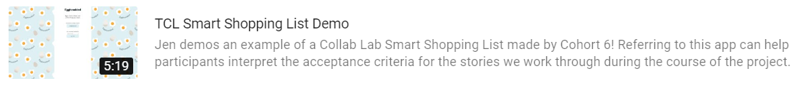
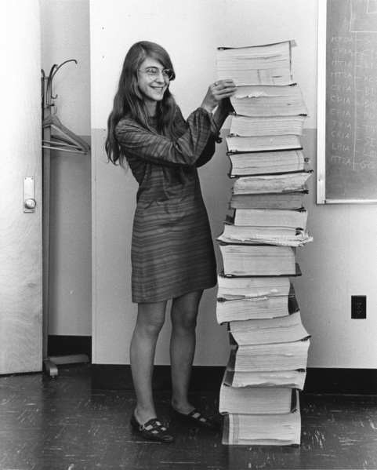

# The Collab Lab Orientation

## What is The Collab Lab?

The Collab Lab exists to help early-career engineers gain experience working collaboratively on a software team by working remotely on real-world projects with other early-career developers.

The goal of this project is to work together to build a “smart” shopping list that learns your shopping habits over time, putting items you are most likely to need to buy in the near future at the top.

Every team builds their app from the same set of instructions, but each comes out a little different, reflecting the personality of the group.

:tv: &nbsp; Check out a video demo of the app team #6 made here:

## Who am I working with?

When new developers and mentors join the Collab Lab community they join a group of brilliant and supportive friends that stretch across the globe. Every quarter a new cohort starts that consists of several regionally-based teams. Those teams are comprised of four developers who collaborate to complete an app of their own and three mentors to help support them through the project.

## Why do we do what we do?

Knowing how to code is just one aspect of being a professional web developer. Another super important skill is knowing how to collaborate effectively on a software team—that’s where Collab Lab comes into play!

### Pair Programming:

A portion of your dedicated hours each week will be spent [pair programming](https://www.microverse.org/blog/how-remote-pair-programming-works-and-why-it-can-change-your-life) with your partner for the week—this is where the most magical collaboration happens.

Pair programming offers some really exciting opportunities to teach/learn from your partner, get a different perspective and/or insight on the issues you’re facing, and drive forward progress on your goals.

There is no one “right” way to pair program, but in general you will meet with your partner on Zoom to work through the story or task you’ve chosen for that week. You’re encouraged to test out different approaches to pair programming to see what works best for your and your partners’ collaboration styles.

## How does it all work?

The project is organized in GitHub as a set of [user stories](https://www.mountaingoatsoftware.com/agile/user-stories), each with a description of the desired functionality as well as [acceptance criteria](https://www.leadingagile.com/2014/09/acceptance-criteria/) that describe how you know whether the task or story is complete. You can find the stories on the project board on GitHub. This is referred to as the “backlog” (the collection of stories) and represents the work needed to complete the project.

A task or story is “done” when the following are all true:

- The AC have been met
- In the case of a UI feature, it has been reviewed for [accessibility](https://accessibilityinsights.io/)
- The code to complete the task or implement the feature has been reviewed and approved by the other pair of developers
- The [Product Owner](https://www.agilealliance.org/glossary/product-owner/) (i.e. one of the mentors) has accepted the work as satisfactorily meeting the requirements

Each week the team will split into pairs and each pair will be responsible for completing a single story from the backlog.

At the end of the 8 week project all of the stories will be complete and we will have a beautifully functioning app that the team has collaboratively built!

### Coordination & communication

It’s super helpful both to yourself and the mentors for you to document your work. This can prevent you from losing track of details or decisions you make with your pair buddy. It also allows mentors to catch up on your progress when you ask for help.

One of the first things you & your pair buddy should do each week is create a [draft PR](https://help.github.com/en/github/collaborating-with-issues-and-pull-requests/about-pull-requests#draft-pull-requests) for your work. This allows you to have a conversation about the work right alongside the code. Coupled with questions and discussions about your approach in the issue itself, this is nice way of documenting your progress as you go.

### Slack

Most of our team coordination will happen through [the Collab Lab Slack team](https://the-collab-lab.slack.com) and in particular your team channel.

If you’re not already super familiar with Slack, no worries! Here are a couple of tips to help you use it like a pro!

1. Threads threads threads! No seriously, threads! 😅 Threads are great because they do 2 really helpful things:
   - They encapsulate conversations so the future you is able to find both the question and the answer in one place
   - They keep notifications to a minimum, giving people the option of following a conversation or not.
2. Speaking of notifications, tag people in when you need their attention. “`@stacie`, could you review this PR?” is better than “Can someone review this PR?” because the latter may not be seen for a while depending on the person’s notification settings. When you need to alert the whole channel to something use `@here`. We also have groups set up such as `@group-tcl-9` and `@group-tcl-9-mentors` as shortcuts to tagging in certain groups. Use them!
3. Use GIFs and emoji liberally! Communicating via text can come across really dry. Don’t be afraid to communicate a little emotion along with that question about React hooks! 🤪

**Note:** You can disable the animation of gifs and emoji in the Slack app itself. Visit [the Slack Help Center](https://slack.com/help/articles/228023907-Manage-animated-images-and-emoji) to learn more.

### Development process

Work will be done on feature branches in git. Branches should be named in the following way:

    <initials of person 1>-<initials of person 2>-<short description>

For example:

    st-an-connect-to-firestore

The hypothetical example above has Stacie Taylor and Alejandro Ñáñez working together on connecting the app to Firestore. Each of them will be able to work on the feature branch independently, but only one of them will submit the merge request when the work is ready (described in more detail below).

When you’re ready to start work on a feature, one person in your pair should create a local branch following the naming convention above, then push the branch to GitHub so your pair buddy can pull it down to their local environment. The following steps should work to do just this:

    git checkout -b an-example-feature-branch
    git push -u origin an-example-feature-branch

When you and your pair partner have working code that you believe is ready to be merged to `main` and deployed, you will follow the following steps:

1. Create a “[pull request](https://help.github.com/en/github/collaborating-with-issues-and-pull-requests/creating-a-pull-request)” (PR).
2. Notify the other pair team in Slack that you have a new PR for them to review.
3. Incorporate feedback from the other pair team into your work until both you and they are satisfied the code is ready to be merged.
4. Request that one of the mentors review the PR for final approval.
5. Once approved, merge the PR into `main`. (Your code will be built and deployed to production automatically thanks to [Firebase Hosting](https://firebase.google.com/docs/hosting).)
6. Check your work on the production site.
7. Celebrate! 🥳

## When does everything happen?

The project should take about 40 hours total over the 8 weeks. That breaks down to roughly 5 hours per week. At least 2-3 hours of that time will be spent pair programming with your partner, 1 hour will be allotted for Weekly Syncs, and the rest of your time will be researching, code reviewing, and organizing your work.

### Weekly Cadence

A week sounds like a long time in some ways, but part of working on a team is accounting for coordination costs. Let’s walk back our goal of demoing from the production URL on the weekend to see when different things need to happen. This example timeline assumes the Weekly Sync is on Sunday.

- Monday, Tuesday, Wednesday — Work out approach, research if needed, and pair program
- Thursday — Complete story and ask for peer feedback
- Friday — Respond to/give peer feedback on PRs and ping mentors for feedback
- Saturday — Respond to mentor feedback on PRs
- Sunday — Demo on production!

Having watched many cohorts before yours, our advice is to front-load the work as much as possible in the first couple of days of each week. Some of the stories are trickier than they appear on the surface!

### Weekly Syncs

Every weekend the team will gather for 1-hour on Zoom for a Weekly Sync. Those meetings will always follow a familiar pattern:

- Demos/discussion (15 minutes)
  - The call will always start with each pair presenting a quick demo of the feature they built in “production”, the live version of the app that is deployed to the web for the world to see. This is followed by a concise walk-through of the code they wrote to build it. This is a common practice on most software teams that lets you practice talking about your work, which can come in handy in a job interview setting!
- Learning module (30 minutes every other week)
  - Presentations by mentors on topics that align with what your team is learning. Examples include git, code reviewing, pair programming, and communication for developers.
- Retrospective (30 minutes every other week)
  - In our retros, we will share appreciations of our teammates, talk about what went well from a process perspective, and discuss what we could do to improve how we’re working together.
- Planning (15 minutes)
  - Mentors meet with pairs to talk through approach to the upcoming week’s work (15 minutes)

## Let's recap!

Whew, that was a lot, right? There’s a good chance (💯%) we’re forgetting or glossing over something important, so please be noisy on Slack as things come up. We will do our best to get you unstuck. Also, lean on each other for help as well! Finally, work in the open so everyone can benefit from your questions.

**Let's run through a quick, high-level recap of what your time at The Collab Lab will look like:**

- During your time at The Collab Lab, you’ll gain experience working on a software team, led by people in the industry, on a project structured in a way very close to what you’d see at many companies.
- We will spend 8 weeks working together to build a smart shopping list app. See a demo of the same app that a previous team built [here](https://www.youtube.com/watch?v=uWgkwY_VBPo&feature=youtu.be).
- Collab Lab teams consist of 4 developers and 3 mentors.
- Each week, the team’s developers will break up into 2 pairs. Each pair will tackle a single issue from the project board in the team’s GitHub repo.
- Developers will each spend about 5 hours per week working on the project. These hours include pair programming with weekly partners, researching, working with partner asynchronously on issues, creating pull requests, and doing code reviews.
- Each weekend during the program, the team will have a Weekly Sync where developers will demo the feature they built in the previous week and a mentor will lead a learning module or the team participate in a retrospective.

## What's Next?

Your team will kick off the project with your first weekly sync this weekend. In the meeting we will present a Learning Module on git best practices and get everyone set up to collaborate on the app. Afterwards you will schedule pair programming sessions with your partner to work through your story of the week!

### Let's Do This!

[Margaret Hamilton](https://www.smithsonianmag.com/smithsonian-institution/margaret-hamilton-led-nasa-software-team-landed-astronauts-moon-180971575/) and her team's code for the Apollo Project
