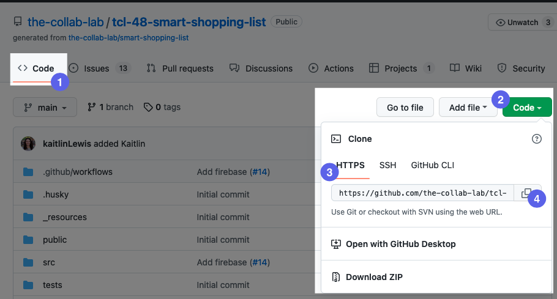
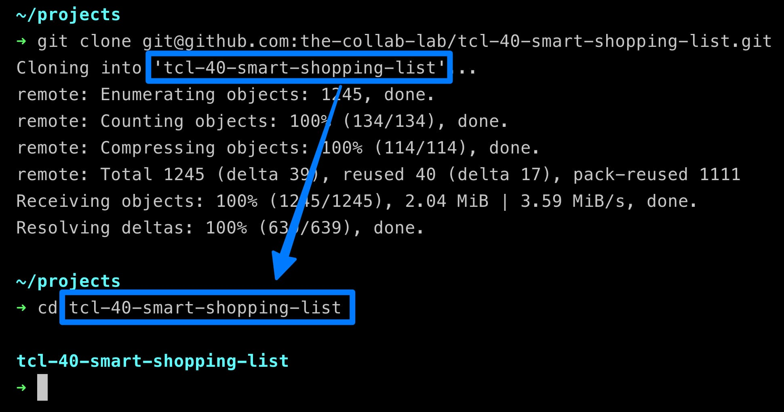
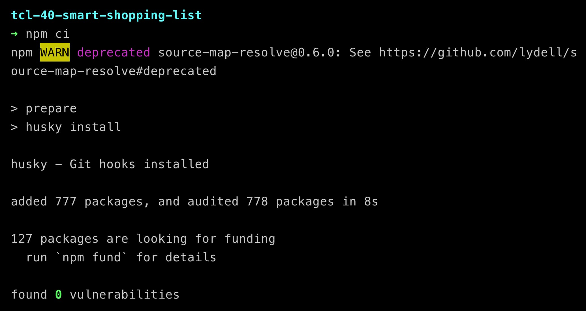
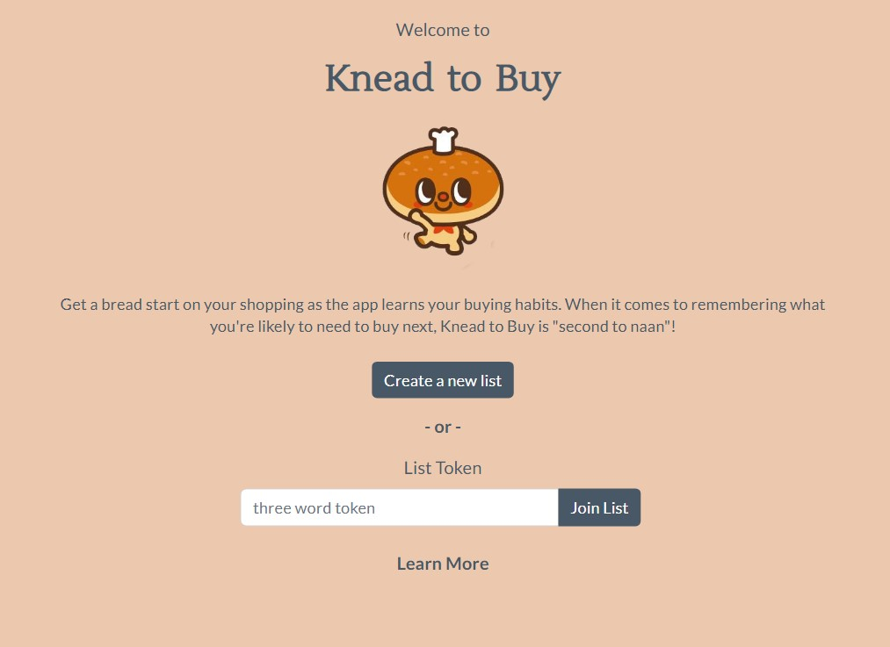

# Knead To Buy

A full stack React app for shoppers who want to keep track of things they buy and remember how soon they need to buy them again.

## Why We Built This

This project is the culmination of the collaborative efforts of four highly-skilled developers as part of [The Collab Lab](https://the-collab-lab.codes) program under the guidance of mentors. It serves as a milestone in our ability to work together and acquire new technical skills and adopt the Agile methodology.

### Developers:

- Alex D'Antonio
- Ashelle Cancio
- Randall Bustamante
- Sarah Jenkins

## Techologies/Tools Used

- React.js
- Vite
- React Boostrap
- HTML5/CSS3
- Firebase/Firestore

## Live Demo

Try the app live at https://tcl-54-smart-shopping-list.web.app/

## Features

- User can create a new shopping list
- User can join an existing list
- User can exit their list to join/create a new one
- User can view an onboarding modal to learn more about the app
- User can add items to their list
- User can delete items from their list
- User can choose how urgent they want to buy the items
- User can mark items as purchased
- User can see the app learn the intervals at which the items are bought and predict how soon these items need to be bought again

## Stretch Features

TBD

## Preview

(In progress...)

## Testing

### System Requirements

To run this build and its dependencides, you'll need these in your local machine:

- Node.js v18 or higher
- NPM 8 or higher

### Getting Started (cloning repo)

1. Click on the "Code" tab. It may already be selected.
2. Click the green "Code" button to reveal a "Clone" popup.
3. The "HTTPS" tab should be automatically selected. If not, click "HTTPS."
4. Click the copy button to copy the url of this repository to your clipboard.
   

From your terminal, `cd` into the directory where you want this project to live.

Once you’re in the directory, type `git clone` followed by the web URL you just copied to your clipboard from GitHub. Then `cd` into the directory that is created.

### Install the project’s dependencies

Once you’ve cloned the project locally and you’re in the project directory, you’ll want to install the project’s dependencies. To do so, type the following into your terminal: `npm ci`

### Access the project in your browser

After you’ve cloned the project locally and updated the dependencies, run the project by typing the following into your terminal: `npm start`. You should be able to see the project at `localhost:3000`.

