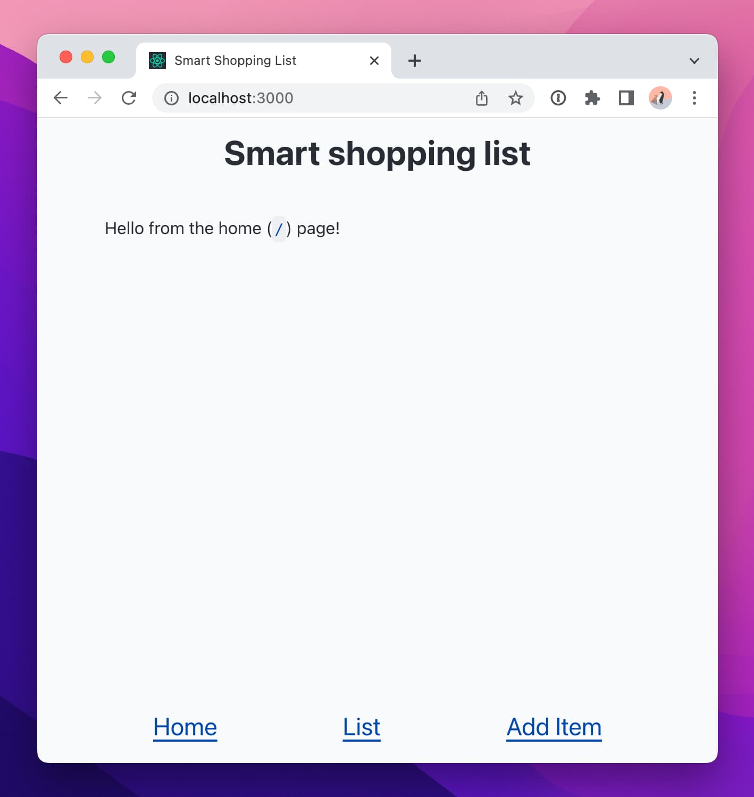

## Overview

This README file explains The Collab Lab’s smart shopping list project and provides instructions for developing it locally.

If you’re a Collab Lab developer, WELCOME! We’re so excited to work with you and collaborate on something amazing. Be sure to read [the setup instructions](#set-up-the-project) and then [make your first contribution](#make-your-first-contribution)! For additional details on how your cohort will operate, please check out the [project brief](PROJECT-BRIEF.md).

## What is this project?

The goal of this project is to collaborate with your Collab Lab team to create a “smart” shopping list app that learns your buying habits and helps you remember what you’re likely to need to buy on your next trip to the store.

### How does it work?

As a user, you will enter items (e.g., “Greek yogurt” or “Paper towels”) into your list. Each time you buy the item, you mark it as purchased in the list. Over time, the app comes to understand the intervals at which you buy different items. If an item is likely to be due to be bought soon, it rises to the top of the shopping list.

### Check out an example

The app will work in many of the same ways as [iNeedToBuy.xyz](https://app.ineedtobuy.xyz/) (on which our project is based) with the exception that we will not be implementing barcode scanning (that feature would add a lot of scope to the project and wasn’t all that useful).

📺&nbsp; Check out a video demo of the example app here:

## Set up the project

### Install Node and NPM

`npm` is distributed with Node.js, which means that when you download Node.js, you automatically get `npm` installed on your computer. You can install Node by [downloading it from the Node.js website](https://nodejs.org/en/) or using a Node version manager like [nvm](https://github.com/nvm-sh/nvm) on a macOS or Linux device or [nvm-windows](https://github.com/coreybutler/nvm-windows) on a Windows device.

💡 **Note:** This project requires the latest Long Term Support (LTS) version of Node. If you have an earlier version of Node, now would be a great time to upgrade!

### Clone the project locally

On GitHub, navigate to the repo for your cohort’s project (you’re probably there right now), then:

1. Click on the "Code" tab. It may already be selected.
2. Click the green "Code" button to reveal a "Clone" popup.
3. The "HTTPS" tab should be automatically selected. If not, click "HTTPS."
4. Click the copy button to copy the url of this repository to your clipboard.
   

From your terminal, `cd` into the directory where you want this project to live.

Once you’re in the directory, type `git clone` followed by the web URL you just copied to your clipboard from GitHub. Then `cd` into the directory that is created.

### Install the project’s dependencies

Once you’ve cloned the project locally and you’re in the project directory, you’ll want to install the project’s dependencies. To do so, type the following into your terminal: `npm ci`

### Access the project in your browser

After you’ve cloned the project locally and updated the dependencies, run the project by typing the following into your terminal: `npm start`. You should be able to see the project at `localhost:3000`.

🎉 You did it! You’re ready to start contributing!

## Make your first contribution

You’ll want to make your first contribution to this repo before your kick-off call! This will help make sure you’re ready to go on day one.

1. Get this project set up locally by following [the setup instructions](#set-up-the-project).
2. Add your name to the [CONTRIBUTORS.md](CONTRIBUTORS.md) file.
   - Do this from your local environment and not from GitHub in your browser. The purpose (aside from highlighting our amazing team) is to make sure your local environment is set up properly!
   - Commit to the `main` branch and push it up to the remote repo. (Over the next 8 weeks, we will rely on feature branches as we collaborate on the project, but for this task committing to main will do just fine.)
